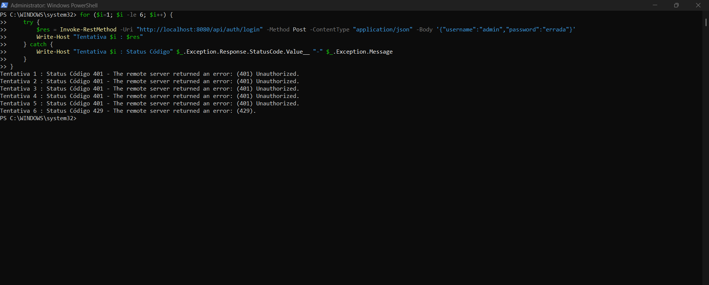
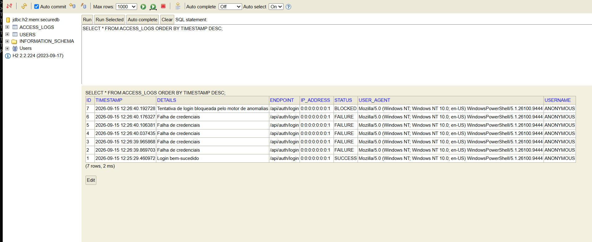
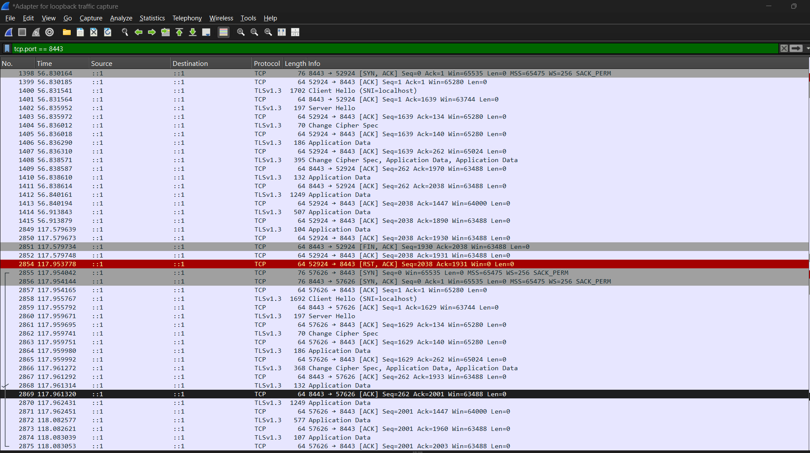
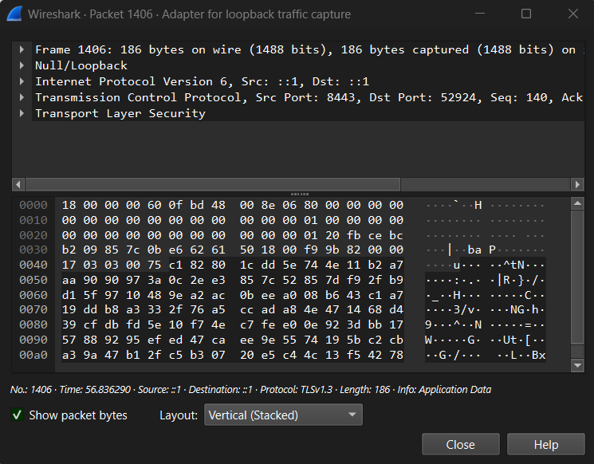

# 🛡️ Secure Access Manager

A security-focused identity and access management system built with **Java 17** and **Spring Boot 3.3.4**.

The goal of this project is to go beyond a basic login system and demonstrate how common security controls can be implemented and tested in a real application.

The project currently includes:

- 🔐 Password hashing with BCrypt
- 👤 Role-Based Access Control (RBAC)
- 🎫 JWT-based authentication
- 🚨 Brute-force detection and rate limiting
- 📋 Immutable-style audit logging
- 🔒 HTTPS with TLS 1.3
- 🔎 Security testing with PowerShell, H2 Console and Wireshark

This project was built as a practical cybersecurity lab, with a focus on **authentication, access control, attack detection and forensic visibility**.

---

## 🏗️ Security Architecture

The application was designed around several layers of defense rather than relying on authentication alone.

| Security Control          | Implementation                   | Purpose                                                                      |
| ------------------------- | -------------------------------- | ---------------------------------------------------------------------------- |
| **Password Protection**   | `BCryptPasswordEncoder`          | Protects stored passwords against offline cracking and rainbow table attacks |
| **Authentication**        | Signed JWT tokens (HS256)        | Provides stateless authentication between the client and API                 |
| **Authorization**         | Role-Based Access Control (RBAC) | Prevents users from accessing resources outside their role                   |
| **Brute-Force Detection** | Moving-window rate limiter       | Detects repeated failed login attempts from the same IP                      |
| **Audit Logging**         | `AuditFilter` + database records | Provides visibility into authentication and access events                    |
| **Transport Security**    | HTTPS / TLS 1.3                  | Protects credentials and tokens while travelling over the network            |

---

# 🧪 Security Testing

One of the main goals of this project was not just to implement security controls, but to **actually test them and collect evidence that they work**.

## 1. Brute-Force Detection & Rate Limiting

The application keeps track of failed login attempts by source IP address using a **2-minute rolling window**.

After **5 failed attempts**, subsequent requests from the same IP are temporarily blocked.

Instead of continuing to perform expensive BCrypt password verification, the application rejects the request with:

```text
HTTP 429 Too Many Requests
```

This helps reduce the impact of automated brute-force attempts and avoids unnecessary password-hashing operations.

### Test

The attack was simulated using PowerShell by repeatedly sending invalid login requests.

The result shows the application initially returning:

```text
401 Unauthorized
```

for invalid credentials, followed by:

```text
429 Too Many Requests
```

once the rate limit was reached.



*Figure 1 — PowerShell brute-force simulation showing failed authentication followed by rate limiting.*

---

## 2. Audit Trail

Security events are recorded in the application's `ACCESS_LOGS` table.

The logs contain information such as:

- Timestamp
- Source IP address
- Requested endpoint
- Event status
- Authentication result

For example, failed authentication attempts and blocked requests are recorded as security events.

This provides a basic forensic trail that could later be forwarded to a centralized logging or SIEM platform.



*Figure 2 — H2 Console showing authentication and security events stored in the audit log.*

---

## 3. TLS 1.3 & Encrypted Traffic

The application runs over HTTPS using **TLS 1.3** on port `8443`.

I used **Wireshark** to inspect the connection and verify that the application data is not transmitted as readable HTTP traffic.

### TLS Handshake

The capture shows the TLS 1.3 handshake between the client and server, including the negotiation of the secure connection.



*Figure 3.1 — Wireshark capture showing the TLS 1.3 Client Hello and Server Hello.*

### Encrypted Application Data

After the TLS handshake, HTTP data is carried inside encrypted TLS Application Data frames.

The captured payload does not expose the credentials or JWT contents in plaintext.



*Figure 3.2 — Wireshark inspection of an encrypted TLS Application Data frame.*

---

# 🚀 Running the Project

## Prerequisites

Make sure you have the following installed:

- **Java JDK 17+**
- **Apache Maven**
- **Wireshark** (optional, only required for the network security tests)

---

## 1. Clone the Repository

```bash
git clone https://github.com/YourUsername/Secure-Access-Manager.git
cd Secure-Access-Manager/Secure_Access_Manager
```

---

## 2. Generate the TLS Keystore

The application uses a PKCS12 keystore for local HTTPS development.

On Windows PowerShell:

```powershell
& "C:\Program Files\Java\jdk-17\bin\keytool.exe" `
-genkeypair `
-alias secureaccess `
-keyalg RSA `
-keysize 2048 `
-storetype PKCS12 `
-keystore src/main/resources/keystore.p12 `
-validity 365 `
-storepass password123 `
-dname "CN=localhost, OU=Dev, O=SecureAccess, L=Dublin, ST=Dublin, C=IE"
```

> **Note:** The keystore password above is intended for local development only. Do not use development credentials like this in a production environment.

---

## 3. Start the Application

```bash
mvn spring-boot:run
```

Once the application starts, the API should be available at:

```text
https://localhost:8443
```

Because this is a locally generated certificate, your browser may show a certificate warning. This is expected in a local development environment.

---

# 🗄️ H2 Database Console

The project uses H2 for the development/testing environment.

The database console is available at:

```text
https://localhost:8443/h2-console
```

Use the following connection details:

```text
JDBC URL: jdbc:h2:mem:securedb
User: sa
Password: leave empty
```

---

# 🔍 Security Testing Tools

The project was tested using several tools:

| Tool           | Usage                                                   |
| -------------- | ------------------------------------------------------- |
| **PowerShell** | Simulating repeated failed login attempts               |
| **H2 Console** | Inspecting authentication and audit records             |
| **Wireshark**  | Inspecting TLS handshakes and encrypted network traffic |
| **Maven**      | Building and running the Spring Boot application        |

---

# 🎯 What This Project Demonstrates

This project is mainly a practical demonstration of how several security concepts work together:

**Authentication → Authorization → Detection → Logging → Encryption**

A successful login is only one part of the security model.

The application also needs to be able to:

- determine **who** the user is;
- determine **what** they are allowed to access;
- detect suspicious authentication activity;
- record security-relevant events;
- protect sensitive information while it travels across the network.

The project is intentionally designed as a **security laboratory**, so the implementation can be tested, observed and improved rather than simply treated as a black-box application.

---

# 📌 Future Improvements

Some areas I plan to explore as the project evolves:

- [ ] PostgreSQL instead of the in-memory H2 database
- [ ] Refresh token rotation
- [ ] Account lockout policies
- [ ] Centralized log collection
- [ ] Integration with an actual SIEM platform
- [ ] Security event dashboards
- [ ] Docker deployment
- [ ] Automated security tests
- [ ] More granular RBAC permissions
- [ ] Secret management instead of hardcoded development credentials

---

## 📚 Project Purpose

This project was created to strengthen my practical understanding of **application security, authentication, network security and threat detection** while building something that can be tested and demonstrated end-to-end.

Rather than only studying these concepts theoretically, the goal is to implement them, attack the application in a controlled environment, inspect what happens, and use the results to improve the system.
